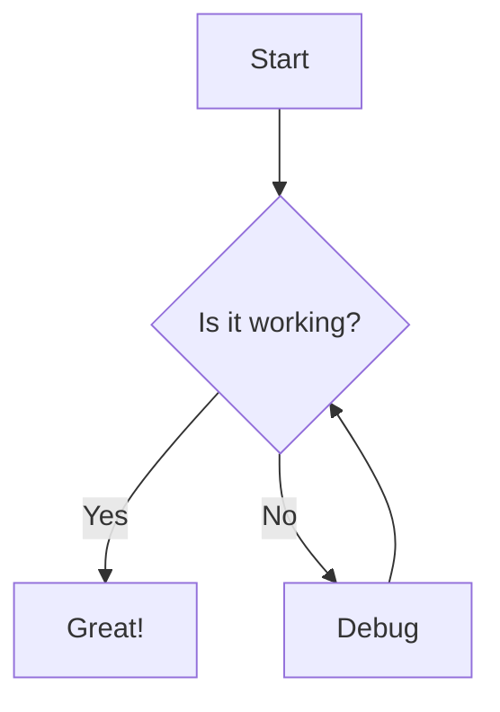
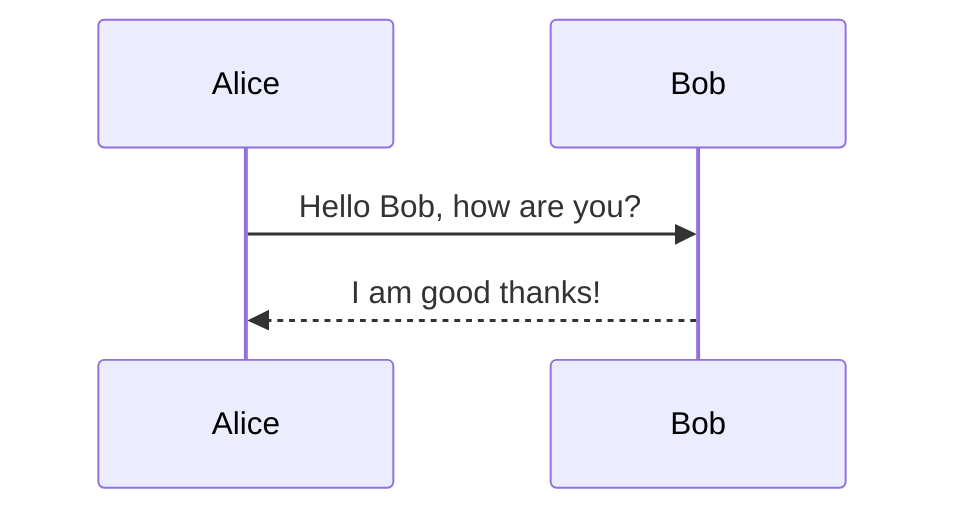
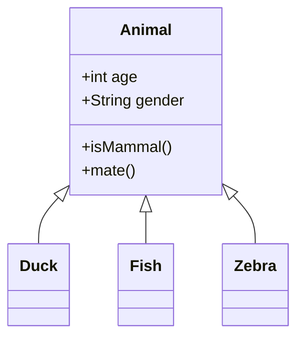

# effect-mermaid

[](https://badge.fury.io/js/effect-mermaid)
[](https://badge.fury.io/js/effect-mermaid-node)
[](https://badge.fury.io/js/effect-mermaid-react)

Effect-based Mermaid diagram rendering for TypeScript applications. Render beautiful diagrams with full type safety and functional programming patterns.

## Packages

- **`@effect-mermaid`** - Core types, interfaces, and stub implementation
- **`@effect-mermaid-node`** - Node.js implementation with real Mermaid.js rendering
- **`@effect-mermaid-react`** - React components for browser-based diagram rendering

## Quick Start

### Node.js (Server-side)

```typescript
import { Effect } from "effect";
import { NodeMermaid } from "@effect-mermaid-node";

const program = Effect.gen(function* () {
  const mermaid = yield* NodeMermaid;
  const svg = yield* mermaid.render("graph TD\n  A-->B");
  console.log(svg);
});

Effect.runPromise(Effect.provide(program, NodeMermaid.Default));
```

### React (Browser)

```tsx
import React from "react";
import { MermaidDiagram, MermaidProvider } from "@effect-mermaid-react";

function App() {
  return (
    <MermaidProvider>
      <MermaidDiagram
        diagram={`graph TD
          A[Start] --> B{Decision}
          B -->|Yes| C[Action]
          B -->|No| D[End]`}
        config={{ theme: "dark" }}
      />
    </MermaidProvider>
  );
}
```

### Testing (Stub Implementation)

```typescript
import { Effect } from "effect";
import { Mermaid } from "@effect-mermaid";

const program = Effect.gen(function* () {
  const mermaid = yield* Mermaid;
  const svg = yield* mermaid.render("graph TD\n  A-->B");
  // Returns stub SVG for testing
});

Effect.runPromise(Effect.provide(program, Mermaid.Default));
```

## Features

- ✅ **Type Safe**: Full TypeScript support with strict typing
- ✅ **Functional**: Built with Effect for composable, testable code
- ✅ **Multiple Environments**: Node.js server-side and React browser support
- ✅ **Theme Support**: Built-in themes and custom styling
- ✅ **Error Handling**: Comprehensive error types and handling
- ✅ **Testing Ready**: Stub implementations for easy testing
- ✅ **Tree Shakeable**: Optimized bundle sizes

## Installation

```bash
# Core package (includes types and testing utilities)
pnpm add effect-mermaid

# Node.js implementation (includes core)
pnpm add effect-mermaid-node

# React components (includes core)
pnpm add effect-mermaid-react
```

## API Overview

### Core Types

```typescript
import type { DiagramType, MermaidConfig, MermaidApi } from "@effect-mermaid";

type DiagramType = "flowchart" | "sequence" | "class" | "state" | "gantt" | "unknown";

interface MermaidConfig {
  theme?: "default" | "dark" | "forest" | "neutral";
  themeVariables?: Record<string, unknown>;
  // ... more options
}

interface MermaidApi {
  render(diagram: string, config?: MermaidConfig): Effect<string, MermaidError>;
  detectType(diagram: string): Effect<DiagramType, MermaidError>;
}
```

### Error Types

```typescript
import { MermaidError } from "@effect-mermaid";

class MermaidError extends Data.TaggedError("MermaidError")<{
  reason: "Parse" | "Render" | "Unknown";
  message: string;
  diagram?: string;
}> {}
```

## Examples

### Basic Flowchart



### Sequence Diagram



### Class Diagram



## Configuration

### Themes

```typescript
const config: MermaidConfig = {
  theme: "dark",
  themeVariables: {
    primaryColor: "#ff6b6b",
    primaryTextColor: "#fff",
    primaryBorderColor: "#ff4757",
  }
};
```

### Diagram-specific Options

```typescript
const config: MermaidConfig = {
  flowchart: {
    htmlLabels: true,
    curve: "basis"
  },
  sequence: {
    actorMargin: 50,
    mirrorActors: false
  }
};
```

## Development

### Building

```bash
# Build all packages
pnpm build

# Build specific package
pnpm --filter effect-mermaid build
pnpm --filter effect-mermaid-node build
pnpm --filter effect-mermaid-react build
```

### Testing

```bash
# Test all packages
pnpm test

# Test specific package
pnpm --filter effect-mermaid test

# Run with coverage
pnpm test:ci
```

### Type Checking

```bash
# Check all packages
pnpm check
```

## Contributing

1. Fork the repository
2. Create a feature branch
3. Make your changes
4. Add tests for new functionality
5. Run the test suite: `pnpm test`
6. Submit a pull request

## License

MIT © [Your Name]

## Related

- [Effect](https://effect.website) - Functional programming framework
- [Mermaid](https://mermaid.js.org) - Diagram generation library
